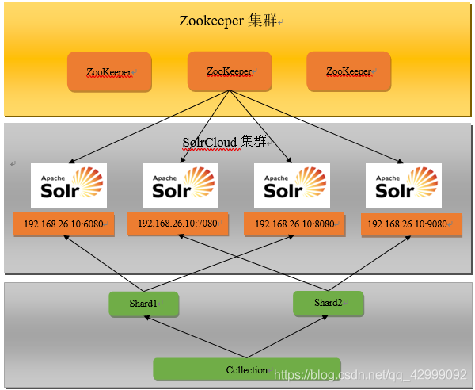
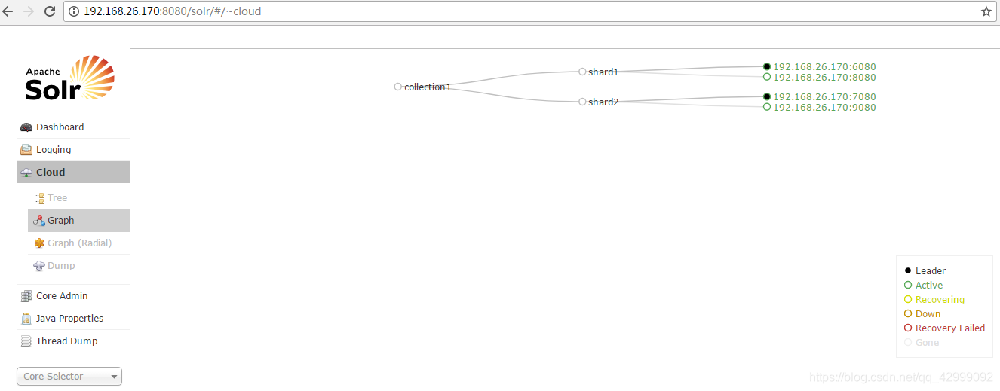
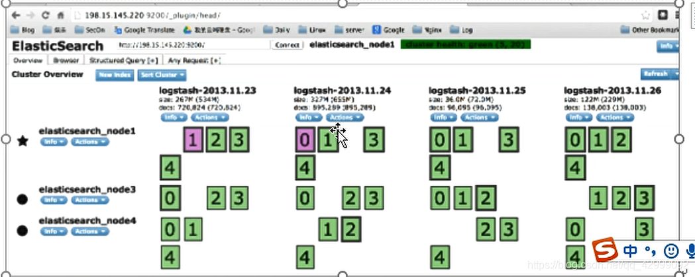

背景：他们都是基于 Lucene 搜索服务器基础上开发，一款优秀的，高性能的企业级搜索服务器，【是因为他们都是基于分词技术构建的倒排索引的方式进行查询】

开发语言：Java

诞生时间：

Solr：2004年诞生

ES：2010年诞生

ES 更新【功能越强大】

新技术的出现，会弥补老技术的缺点，吸取老技术的优点

区别：

1、当实时建立索引的时候，solr 会产生 io 阻塞，而 es 不会，es 查询性能要高于 solr

2、在不断动态添加数据的时候，solr 的检索效率会变得低下，而 es 没有什么变化

3、Solr 利用 zookeeper 进行分布式管理，而 es 自带有分布式系统的管理功能，Solr 一般都要部署到 web 服务器上，比如 tomcat，启动 tomcat 的时候需要配置 tomcat 和 solr 的 关联 【 Solr 的本质，是一个动态的 web项目】

4、Solr支持更多格式的数据 【xml、json、csv 】等，而 es 仅仅支持 json 文件格式

5、Solr 是传统搜索应用的有利解决方案，但是 es 更加适用于新兴的是是搜索应用

​ 单纯的对已有的数据进行检索， solr 效率更好，高于 es

6、 Solr 官网提供的功能更多哦，而 es 本身更加注重于核心功能，高级功能都有第三方插件完成

SolrCloud 集群图

Elasticsrarch ：集群图

————————————————
版权声明：本文为CSDN博主「Evan Guo」的原创文章，遵循CC 4.0 BY-SA版权协议，转载请附上原文出处链接及本声明。
原文链接：https://blog.csdn.net/qq_42999092/article/details/109068522