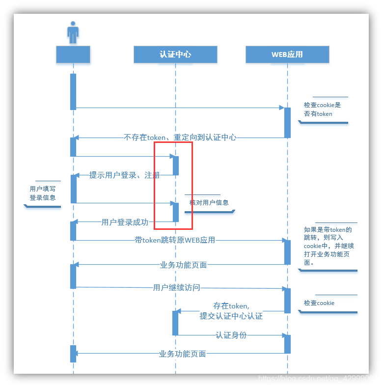

单点登录: 一处登录多处使用！

前提：单点登录多使用在分布式系统中

一处登录，处处运行

Demo:

参观动物园流程

检票员=认证中心模块

1、我直接带着大家进动物园，则会被检票员拦住【看我们是否有票】，没有【售票处买票】

登录=买票

2、我去买票【带着票，带着大家一起准备进入动物园】 检票员check【有票】

Token = piao

3、我们手中有票就可以任意观赏动物园的每处景点

京东：单点登录，是将 token 放入到 cookie 中

案例：将浏览器的 cookie 禁用，则在登录京东则失效，无论如何登录不
————————————————
版权声明：本文为CSDN博主「Evan Guo」的原创文章，遵循CC 4.0 BY-SA版权协议，转载请附上原文出处链接及本声明。
原文链接：https://blog.csdn.net/qq_42999092/article/details/109068522