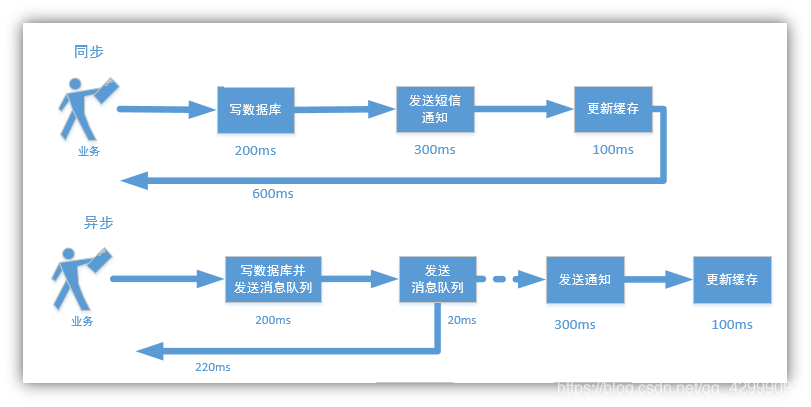
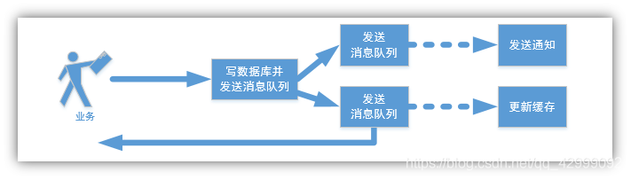
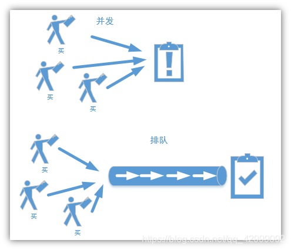
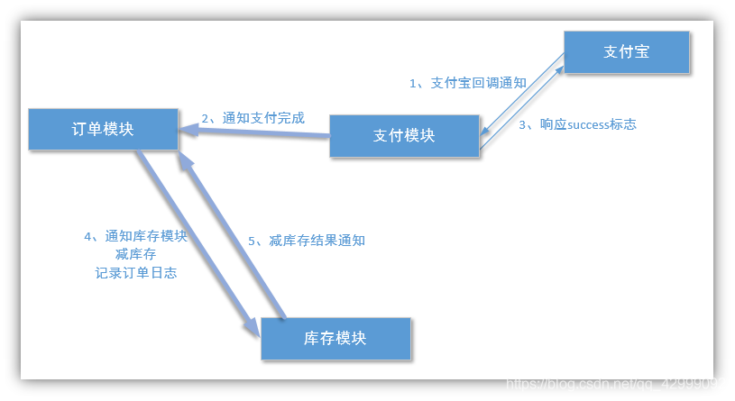

背景： 在分布式系统中如何处理高并发的

由于在高并发的环境下，来不及同步处理用户发送的请求，则会导致请求发生阻塞，比如说，大量的 insert，update 之类的请求同时到达数据库 MySQL, 直接导致无数的行锁表锁，甚至会导致请求堆积过多，从而触发 too many connections ( 链接数太多 ) 错误，使用消息队列可以解决 【异步通信】

1、异步

2、并行

3、排队

消息队列在电商中的使用场景

消息队列的弊端

​ 消息的不确定性： 延迟队列 和 轮询技术来解决问题即可！

推荐大家使用 activemq ！ 环境都是 Java 适环境而定
————————————————
版权声明：本文为CSDN博主「Evan Guo」的原创文章，遵循CC 4.0 BY-SA版权协议，转载请附上原文出处链接及本声明。
原文链接：https://blog.csdn.net/qq_42999092/article/details/109068522